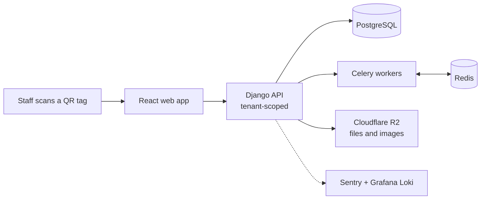
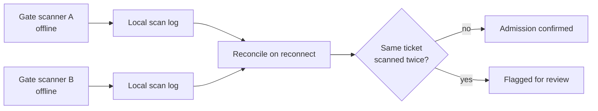
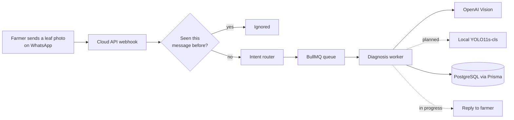
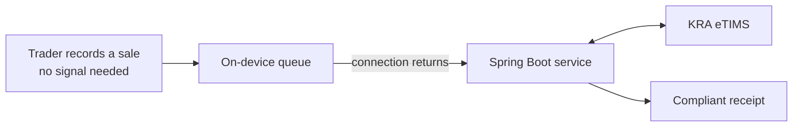
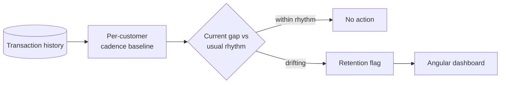
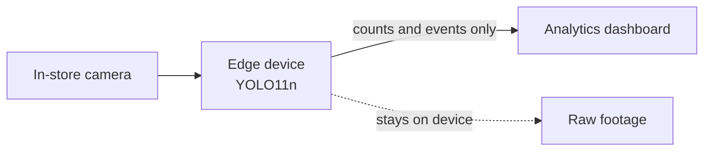

<!--
  Before publishing, replace:
    YOUR-LINKEDIN, YOUR-EMAIL (two places), YOUR-PORTFOLIO-URL
  Optional: point each project card at its repo instead of its route notes.
  Assets are regenerated from build.py (python3 build.py), so edit copy there rather than in the SVGs.
  Images use absolute raw URLs because GitHub does not reliably resolve relative paths inside <picture> srcset.
-->

<picture>
  <source media="(prefers-color-scheme: dark)" srcset="https://raw.githubusercontent.com/surturn/surturn/HEAD/assets/header-dark.svg">
  
</picture>

  
  
  
  

## About

I build software that has to survive real conditions: patchy signal, expensive data, shared phones, and users who will never read a manual. Most of my work sits where backend architecture meets a concrete local problem, like tracking school assets, diagnosing crop disease over WhatsApp, or bringing informal traders into tax compliance.

I founded **Invonics Technologies**, a bootstrapped Nairobi software studio with a four-person founding team, shipping across edtech, fintech, agritech, and events. I'm also on industrial attachment at **Eclectics International**, a banking software vendor serving 260+ financial institutions across Africa, while studying Computer Science at **Multimedia University of Kenya**.

Every project I lead starts with a PRD, an architecture document, and a milestone plan before the first commit. I would rather explain why a system is shaped the way it is than how fast I typed it.

<picture>
  <source media="(prefers-color-scheme: dark)" srcset="https://raw.githubusercontent.com/surturn/surturn/HEAD/assets/now-dark.svg">
  
</picture>

## Selected work

Each card opens its route notes below: the one design decision that matters most, and a diagram of how the pieces connect.

<a href="#route-assetflow"><picture><source media="(prefers-color-scheme: dark)" srcset="https://raw.githubusercontent.com/surturn/surturn/HEAD/assets/cards/assetflow-dark.svg"></picture></a>
<a href="#route-eventify"><picture><source media="(prefers-color-scheme: dark)" srcset="https://raw.githubusercontent.com/surturn/surturn/HEAD/assets/cards/eventify-dark.svg"></picture></a>

<a href="#route-farmassist"><picture><source media="(prefers-color-scheme: dark)" srcset="https://raw.githubusercontent.com/surturn/surturn/HEAD/assets/cards/farmassist-dark.svg"></picture></a>
<a href="#route-risiti"><picture><source media="(prefers-color-scheme: dark)" srcset="https://raw.githubusercontent.com/surturn/surturn/HEAD/assets/cards/risiti-dark.svg"></picture></a>

<a href="#route-lucklotter"><picture><source media="(prefers-color-scheme: dark)" srcset="https://raw.githubusercontent.com/surturn/surturn/HEAD/assets/cards/lucklotter-dark.svg"></picture></a>
<a href="#route-retail"><picture><source media="(prefers-color-scheme: dark)" srcset="https://raw.githubusercontent.com/surturn/surturn/HEAD/assets/cards/retail-dark.svg"></picture></a>

### Route notes

<b>AssetFlow Schools</b>: How it's built

Every request is scoped to a single school tenant, and slow work runs in Celery so a scan at the storeroom door never waits on it.

<b>Eventify</b>: The hard part: offline gates

Two gate scanners that lose signal can each admit the same ticket. Scan logs are reconciled when devices reconnect so duplicates surface instead of slipping through.

<b>FarmAssist</b>: How a leaf photo becomes a diagnosis

WhatsApp retries webhooks, so every inbound message passes an idempotency check before it touches the queue. Diagnosis runs in a worker, never inside the webhook.

<b>Risiti</b>: Offline first, compliant later

Informal traders sell where signal is unreliable. Sales are captured on the device first and synced to eTIMS when a connection returns, so compliance never blocks a sale.

<b>LuckLotter</b>: Why rules, not a model

Deliberately rules-based. A bank team can see exactly why a customer was flagged, which is worth more to them than a model nobody can explain.

<b>Retail analytics</b>: Privacy by architecture

Detection runs on an edge device in the shop. Only counts and events leave the premises, so there is no footage in the cloud to leak.

<picture>
  <source media="(prefers-color-scheme: dark)" srcset="https://raw.githubusercontent.com/surturn/surturn/HEAD/assets/stack-dark.svg">
  
</picture>

## How I build

- **Document before code.** PRD, architecture, and milestones first, so every decision has a reason on record.
- **Design for the network we actually have.** Offline-first, idempotent, and light on data wherever the user is on a phone in the field.
- **Boring infrastructure, interesting products.** Docker Compose on a VPS, Postgres, Redis, a queue. Fewer moving parts, fewer 3am surprises.
- **Observe from day one.** Structured logs and error tracking ship with v1, not after the first outage.
- **Kill bad ideas early.** A feature cut in week one is cheaper than a rewrite in month six.

## Activity

  

<picture>
  <source media="(prefers-color-scheme: dark)" srcset="https://raw.githubusercontent.com/surturn/surturn/output/snake-dark.svg">
  
</picture>

 

  Off the keyboard: football, and FIFA matches I only ever lose to input lag.  
  <b>Open to backend engineering internships and collaborations on software for African markets.</b> 
  <a href="mailto:YOUR-EMAIL">Get in touch</a>

